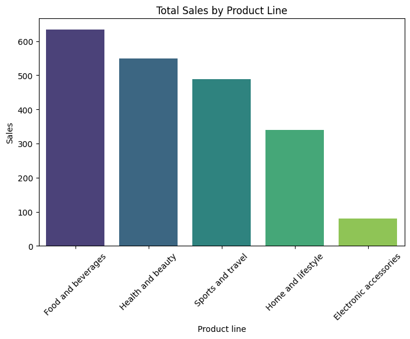
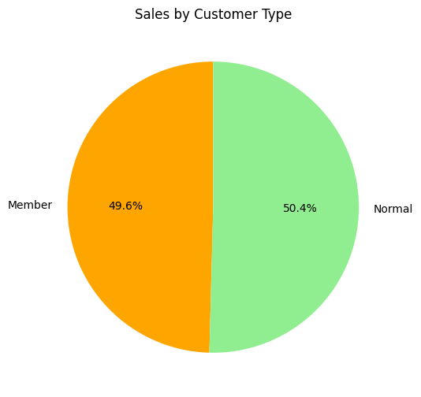
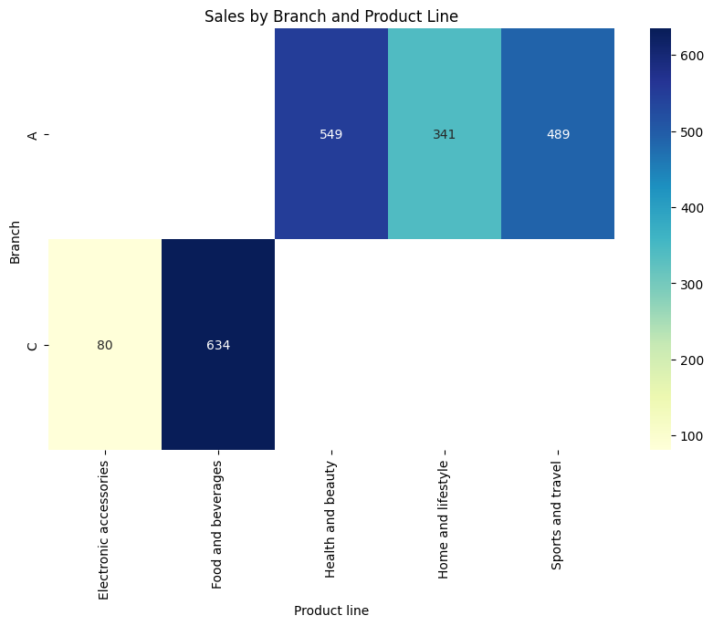
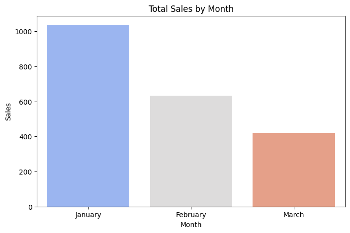

# 🛒 Supermarket Sales Data Analysis using Python  

This project analyzes supermarket sales data to uncover customer behavior, top-performing branches, and product-line trends.  
It demonstrates data analysis, visualization, and insights generation using Python.  

---

## 📌 Tools & Libraries  
- Python 🐍  
- Pandas  
- Matplotlib  
- Seaborn  

---

## 📊 Dataset  
The dataset contains:  
- Invoice ID, Branch, City  
- Customer type, Gender  
- Product line, Unit price, Quantity, Total  
- Date, Time, Payment  

*(Sample dataset used for demo; can be extended to real datasets)*  

---

## 🔎 Methodology  

### 🔹 Data Cleaning  
- Converted dates to datetime  
- Extracted month & weekday features  

### 🔹 Exploratory Data Analysis (EDA)  
- Grouped sales by product line, gender, branch, and customer type  

### 🔹 Visualization  
- Bar charts, pie charts, and heatmaps to highlight trends  

---

## 📈 Results & Insights  
- January had the highest sales, while March saw the lowest  
- Food & Beverages was the best-selling product line  
- Female customers contributed more sales than males  
- Members (loyal customers) spent more than normal customers  
- Branch A performed well in **Health & Beauty** & **Sports**  
- Branch C dominated in **Food & Beverages**  

---

## 📊 Visualizations  

### 🔹 Sales by Product Line  
  

### 🔹 Sales by Gender  
  

### 🔹 Sales by Branch & Product Line (Heatmap)  
  

### 🔹 Sales by Month  
  

---

## ✅ Conclusion  
- Focus on **Food & Beverages** to boost revenue  
- Target **female customers & members** in marketing campaigns  
- Branch-specific strategies:  
  - Branch A → promote Health & Beauty, Sports  
  - Branch C → strengthen Food & Beverages  
- Introduce **discounts/promotions in March** to increase sales  

---

## 📂 Repository Structure  
- `Supermarket_Sales_Analysis.ipynb` → Jupyter Notebook (main analysis)  
- `Supermarket_Sales_Report.pdf` → Polished project report (ready to share)  
- `analysis_script.py` → Python script version (optional)  
- `bar_chart.png`, `pie_chart.png`, `heatmap.png`, `monthly_sales.png` → Graphs for README  

---

## 🌟 How to Use  
Clone this repo:  

```bash
git clone https://github.com/Swetha-676/Supermarket-Sales-Analysis.git
